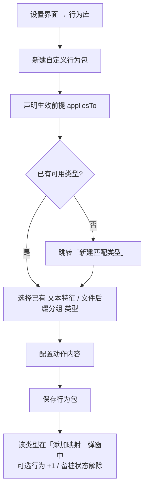

# PRD-lite：用户自定义匹配类型（文本特征 + 文件后缀分组）

## 0. 项目信息

| 项 | 值 |
|---|---|
| Language | 简体中文 |
| Project Name | `keyflux_custom_match_types` |
| 技术栈（现状，非新建项目） | AHK v2 运行时引擎（`bin/lib/**.ahk`，Windows-only） + Go 设置后端 `config-server` + Avalonia C# 设置界面 `config-ui-avalonia`；配置真源 = `data/config.json` |
| 目标用户 | KeyFlux 作者本人 + 少量高级用户（单用户桌面效率工具，非大众消费产品） |
| 界面语言 | 中/英双语（i18n 键机制，键值形如 `"1031"`） |
| 依据文档 | `docs/CONTRACTS.md`、`data/config.json` |

### 原始需求复述

> 对当前 KeyFlux 源代码进行优化，使其支持用户新增匹配类型，涵盖文本特征匹配与文件后缀分组两类；要求用户操作尽可能简便。用户新建匹配类型时，既可同时创建与之对应的匹配行为并与该类型强绑定，也可先留桩、后续再补行为。

拆解为 4 条诉求：
1. **文本特征侧可新增**（例如"网盘链接"）；
2. **文件后缀分组侧可新增/管理**；
3. **两条新建路径**：①「类型 + 行为一次建好并强绑定」；②「先建类型留桩、行为以后再补」；
4. **操作尽可能简便**。

### 现状锚点（已核实，本 PRD 不改动此结论）

- 「选中动作」= 选中文本/文件后按主热键，直接执行或弹菜单选择预设行为。
- 匹配类型固定两类：
  - **fileExt（文件后缀）**：条件值 = 逗号分隔后缀列表（如 `jpg,png`），或 `*` 表示任意文件；手输或从「文件分组」(fileGroups) 快捷填入。
  - **textType（文本特征）**：条件值只能是 4 个硬编码枚举 —— `url` / `path` / `magnet` / `plain`，用户无法新增。
- **行为库**：内置 11 个基础动作；用户可新建自定义行为包，声明"生效前提"(appliesTo)，前提类型同样只有 fileExt / textType 两类，textType 取值受那 4 个固定枚举限制（前端可输入任意值，后端拒绝未知值）。
- **关键约束（本需求的核心张力）**：新增一个文本特征值后，**必须至少有一个行为包声明覆盖它**，否则「添加映射」弹窗里勾选列表为空、确认按钮不可用。这与"先留桩、后补行为"直接冲突，必须在本需求的交互中显式化解。
- **两个可复用的产品先例**：
  - **A. 文件分组 (fileGroups)**：纯配置数据（名称 + 显示名 + 后缀集，如"图片"=`jpg,png,gif`）；在添加映射弹窗做"常用分组快捷填入"，填入后仍可手改，保存时把条件值归一化写回分组。注意：现状它是**快捷填入模板**，不是独立匹配类型。
  - **B. 窗口条件组**：用户可增删多行 `{组名, 条件类型(4 选 1), 值}`，有专用对话框；提供"窗口侦探"按钮，一键从当前窗口抓取值自动填入；组有 id，动作通过 id 引用；内置组（id `0`/`-1`）锁定不可改名。

> 本需求的产品定位：把"用户可自定义的具名条件集"这一模式，从**只有窗口条件组**，扩展为**文本特征类型 + 文件后缀分组类型**同样可用；并复用 A/B 两种先例的交互形态（专用管理对话框 + 一键抓取/快捷填入 + id 引用 + 内置项锁定）。

---

## 1. 产品目标与成功判据

**产品目标**：让用户无需改代码，即可在设置界面新增并管理「文本特征类型」与「文件后缀分组类型」；新建时可"一步建好类型+行为并强绑定"，也可"先留桩后补行为"，两条路径均无死胡同，操作路径最短。

**可验证成功判据**

| # | 判据 | 度量方式 |
|---|---|---|
| S1 | 新增一个文本特征类型（如"网盘链接"）并使其在「添加映射」弹窗可被选到，全程**零代码改动、零手改 json** | 手工走查，界面内可完成 |
| S2 | 新建一个文本特征类型核心步骤 ≤ 3 步、耗时 ≤ 1 分钟 | 计时走查 |
| S3 | 走「先留桩」路径保存的类型，用户在「添加映射」弹窗**不会遇到"勾选列表为空且确认按钮禁用"的静默死胡同**：要么给出明确提示，要么给出"去补行为"的跳转入口 | 走查留桩类型 |
| S4 | 删除/改名一个已被映射或行为引用的类型时，系统**先提示影响面**再执行，不静默破坏既有配置 | 走查引用场景 |
| S5 | 文件后缀分组类型可**增/删/改**，且与既有 fileGroups 数据、"快捷填入"行为不冲突（或明确合并策略） | 走查分组管理 |
| S6 | 中/英双语下新增的所有界面文案均取自 i18n 键，无硬编码中文/英文 | 走查两种语言 |

---

## 2. 用户故事

| ID | As a | I want | So that |
|---|---|---|---|
| US1 | 高级用户 | 新建一个文本特征类型（如"网盘链接"），填显示名 + 特征值 | 我的映射能识别这类文本，无需等作者改代码 |
| US2 | 高级用户 | 新建一个文件后缀分组类型（如"设计稿"=`psd,ai,sketch`）并增删改 | 我按自己的文件习惯归类，不必每次手打后缀串 |
| US3 | 高级用户 | 在新建类型时**顺手创建对应行为包并强绑定** | 一步到位，建完立刻能用，不用去行为库再配一遍 |
| US4 | 高级用户 | 新建类型时**先只留桩**，不建行为 | 先占位、把结构性工作做完，行为等以后有思路再补 |
| US5 | 高级用户 | 修改既有类型的显示名/特征值/后缀集 | 类型定义随需求演进，保持可用 |
| US6 | 高级用户 | 删除既有类型时**先看到影响面**（哪些映射/行为引用了它） | 我清楚会破坏什么，避免误删 |
| US7 | 高级用户 | 在行为库里新建/编辑行为时，**能选到所有自定义类型（含留桩类型）** | 补行为时不被"类型不可见"挡住 |
| US8 | 高级用户 | 在「添加映射」弹窗选到一个**留桩类型**时，被明确告知"暂无可用行为"并能一键去创建 | 不卡在禁用按钮上，知道下一步做什么 |

---

## 3. 需求池（P0 / P1 / P2）

> 优先级：P0 = 必须做（不做则需求不成立）；P1 = 应该做（显著提升体验）；P2 = 可做（锦上添花）。

### P0

| ID | 需求 | 验收要点 |
|---|---|---|
| P0-1 | **类型管理入口**：设置界面提供"匹配类型管理"列表，分「文本特征」「文件后缀分组」两个分区 | 能看到现有 4 个文本特征枚举与全部文件分组；有"新建"按钮；中英双语 |
| P0-2 | **新建文本特征类型** | 填写：显示名（必填）、特征值（必填）；显示名与特征值在文本特征分区内唯一；保存后出现在类型列表与「添加映射」弹窗的可选项 |
| P0-3 | **新建/管理文件后缀分组类型** | 填写：显示名 + 后缀集（逗号分隔或列表）；支持增/删/改；与既有 fileGroups 数据一致（同一份数据或明确迁移策略，待架构决策）；不影响既有"快捷填入"能力 |
| P0-4 | **新建路径①：一次建好并强绑定** | 向导内可直接创建行为包，声明其 appliesTo = 该类型，并配置动作内容；保存后类型与其行为**强绑定**；在建完瞬间，「添加映射」弹窗内该类型下**已有可选行为** |
| P0-5 | **新建路径②：先留桩后补行为** | 允许不创建任何行为即保存类型；类型被标记为"待补行为"状态并在类型列表中可见可识别 |
| P0-6 | **化解"留桩死胡同"**（核心张力） | 「添加映射」弹窗遇到留桩类型时不得静默显示空列表+禁用按钮；必须给出：① 明确文案（如"该类型暂无可用行为，请先创建行为"）② 一键跳转到"为该类型新建行为"的入口 |
| P0-7 | **行为库兼容自定义类型** | 在行为库新建/编辑行为、声明 appliesTo 时，可选到全部自定义文本特征类型与文件后缀分组类型；后端对自定义文本特征值不再仅限 4 个固定枚举，改为"须已存在于类型管理"的校验 |
| P0-8 | **删除/改名影响面提示** | 删除或改名被引用的类型前，弹提示列出引用它的映射/行为数量或清单，确认后才执行；内置类型（4 个文本特征枚举、内置分组，若定为内置）锁定不可删改 |
| P0-9 | **i18n 全覆盖** | 所有新增界面文案走 i18n 键，中英双语可切换 |

### P1

| ID | 需求 | 验收要点 |
|---|---|---|
| P1-1 | **留桩类型显式标记 + 待办提示** | 类型列表中留桩项有"待补行为"徽标；行为库/首页可选出现"有 N 个类型待补行为"的提醒 |
| P1-2 | **从「添加映射」弹窗一键跳转新建类型** | 弹窗内提供"新建匹配类型"入口，创建后返回原弹窗并自动选中新类型 |
| P1-3 | **复用"窗口侦探"式一键抓取/快捷填入** | 文本特征类型支持"从当前选中文本/剪贴板抓取样例"辅助填值；文件后缀分组支持"从选中文件抓后缀"；若技术不可行则降级为纯手输（待核实） |
| P1-4 | **类型排序与展示名编辑** | 可调整类型展示顺序；可改显示名而不改特征值/后缀集（避免破坏既有引用） |
| P1-5 | **强绑定关系可见** | 走路径①创建的类型-行为绑定关系在界面上可见（如类型详情显示其绑定行为包） |

### P2

| ID | 需求 | 验收要点 |
|---|---|---|
| P2-1 | **匹配预览/自测** | 输入一段样例文本或选一个文件，实时显示"命中哪个类型 / 无命中"，辅助建类型 |
| P2-2 | **类型图标/颜色** | 为类型设置图标或颜色，便于区分 |
| P2-3 | **类型与行为包的导入/导出** | 可导出为文件并导入还原；具体是否做见"待确认 Q6" |
| P2-4 | **去重/冲突检测** | 新建类型时提示与既有类型显示名或特征值重复 |

---

## 4. 用户操作流程草案（mermaid）

### 4.1 主流程：新建匹配类型（含两条路径分叉点）

```mermaid
flowchart TD
    A[设置界面 → 匹配类型管理] --> B[点击「新建匹配类型」]
    B --> C{选择类型大类}
    C -->|文本特征| D[输入 显示名 + 特征值<br/>例：网盘链接 / pan]
    C -->|文件后缀分组| E[输入 显示名 + 后缀集<br/>例：设计稿 / psd,ai,sketch]
    D --> F{是否同时创建并绑定行为?}
    E --> F
    F -->|路径① 一次建好| G[向导内创建行为包<br/>appliesTo = 刚建的类型<br/>配置动作内容]
    G --> H[保存：类型 + 行为强绑定]
    H --> K[类型在「添加映射」弹窗可选<br/>且已有可选行为 ✅]
    F -->|路径② 先留桩| I[跳过行为，直接保存类型]
    I --> J[类型标记「待补行为」]
    J --> L[在弹窗中被选中时<br/>提示"暂无可用行为" + 提供"去补行为"入口]
    L --> M[行为库 → 新建行为 → appliesTo 选择该类型]
    M --> K
    K --> N[添加映射：选类型 → 选行为 → 确认完成]
```

### 4.2 附流程：仅创建行为并绑到已有类型



---

## 5. 边界与非目标

**明确不做（非目标）**

| # | 非目标 | 理由 |
|---|---|---|
| N1 | **不开放任意正则/脚本作为匹配条件**（P0 不做） | 会带来安全与 UI 复杂度；如确有需要仅作为后续独立特性（见 Q1） |
| N2 | **不做类型市场 / 在线分享 / 云同步** | 单用户桌面工具，无网络分发场景 |
| N3 | **不改变配置真源** | `data/config.json` 仍为唯一真源，不引入第二套存储 |
| N4 | **不重做快捷键页"窗口条件组"机制** | 作为既有先例保留不动，仅在新方案中复用其交互形态 |
| N5 | **不改变 AHK 引擎的 Windows-only 定位 / 不做热重载** | 超出本需求范围 |
| N6 | **不重做内置行为库的 11 个基础动作** | 保持兼容，仅扩展 appliesTo 的可选类型范围 |
| N7 | **不做大众化/新手引导式产品化** | 目标用户为作者本人 + 高级用户 |

**边界（组内约束）**

- 自定义文本特征类型本质是"具名标签 + 可被人为绑定的识别语义"；它**是否能被自动识别**（如"网盘链接"如何从文本中判定）取决于底层是否有可配置的识别规则 —— 这一点当前代码未提供，属**待核实/待设计**（见 Q1）。
- 类型/pool 的删除策略（阻止 / 级联 / 迁移）属产品决策，见 Q4。

---

## 6. 待确认问题清单（给用户决策）

| # | 问题 | 影响 |
|---|---|---|
| Q1 | **自定义文本特征"如何被识别"？** 仅作为行为包 appliesTo 的标签（人工在映射里指定），还是需要真正的文本识别规则（如子串/正则）？现状代码只支持 4 个固定枚举的识别逻辑。 | 决定"网盘链接"是真能自动命中，还是仅作分类标签；决定是否触碰 N1 |
| Q2 | **留桩类型在「添加映射」弹窗中的默认表现**：隐藏 / 置灰不可选 / 可选但提示"暂无行为"？（P0-6 已定"不得静默死胡同"，此处定具体形态） | 决定核心张力的交互方案 |
| Q3 | **类型是否支持"多值/复合条件"**？还是每类型仅单值（一个特征值 / 一组后缀）？ | 影响数据模型与 UI 复杂度 |
| Q4 | **删除被引用类型的默认策略**：阻止删除 / 级联清除引用 / 强制迁移到其他类型？ | 决定 P0-8 的行为 |
| Q5 | **文件后缀分组 与 现有 fileGroups 是否合并为同一套"用户可管理类型"**？还是区分"内置分组"与"用户自定义分组"两级？ | 决定 P0-3 是否只是给 fileGroups 加管理界面，还是新建独立概念 |
| Q6 | **是否需要类型/行为包的导入导出或分享**？（对应 P2-3、N2） | 决定是否做 P2-3 |

---

## 附：待核实项汇总

- 自定义文本特征类型是否具备"自动识别"能力（现状代码仅 4 个固定枚举）——待核实。
- 从选中文本/文件"一键抓取样例"在 Avalonia 设置界面中是否技术可行（对应 P1-3）——待核实。
- fileGroups 现状是否存在专用管理界面，抑或仅能改 `config.json`——待核实。
